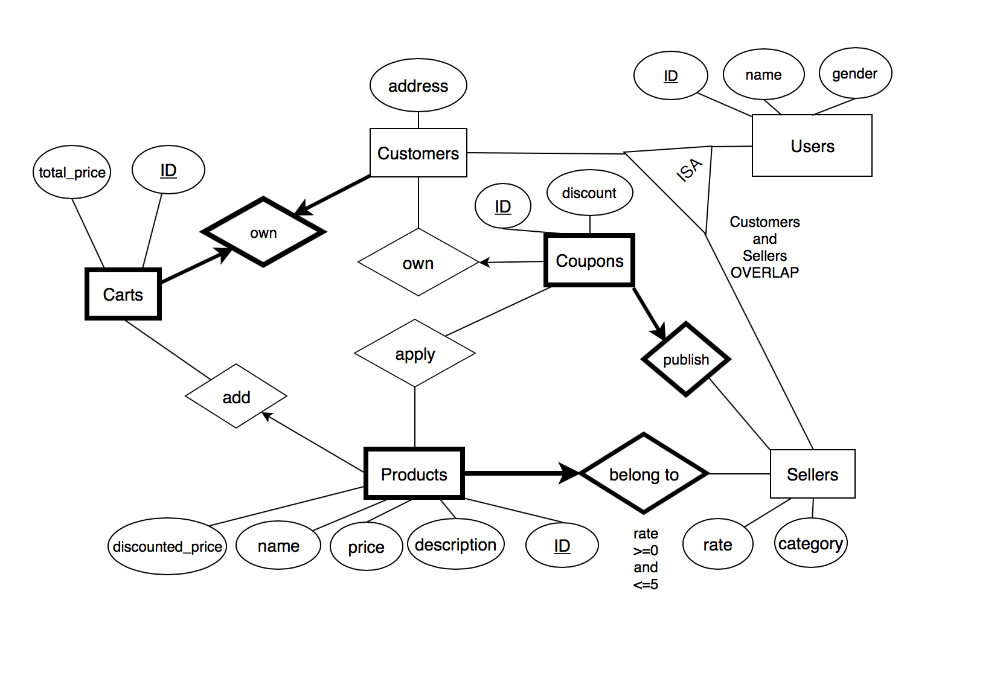

# E-Commerce-Platform

## 1. ER Diagram

## 2. Schema

users (user_id, name, gender, password)

customers (user_id, address)

sellers (user_id, address)

products (product_id, name, description, seller_id, price, quantity)

coupons (coupon_id, discount, seller_id)

orders (order_id, customer_id)

coupon_applied (coupon_id, product_id)

orders_products (order_id, product_id, quantity)

## 3. Functionality Queries

(1) Select the customer with the most products added

``
SELECT customers.user_id  
``
 
``
FROM products, customers, carts  
``
 
``
WHERE customers.use_id = carts.customer_id and 
	    carts.cart_id = products.cart_id  
``
 
``
GROUP BY cutomers.user_id  
``
 
``
ORDER BY count(*) DESC  
``
 
``
LIMIT 1;  
``
 

(2) Select the best seller in terms of the number of sold products

``
SELECT sellers.user_id 
``
 
``
FROM sellers, products
``
 
``
WHERE sellers.user_id = products.seller_id and 
     cart_id in (select cart_id from carts) 
``
 
``
GROUP BY user_id
``
 
``
ORDER BY count(*) DESC
``
 
``
LIMIT 1;
``
 

(3) Select the customer whose products are most expensive after using coupons

``
CREATE VIEW discounted_products AS(
``
 
``
SELECT products.product_id, products.price * (1 -(coupons.discount))
``
 
``
FROM products, coupons, coupon_applied
``
 
``
WHERE coupons.coupon_id = coupon_applied.coupon_id and 
	   coupon_applied.product_id = products.product_id
);
``
 

``
CREATE VIEW final_price AS(
``
 
``
(SELECT product_id, price 
``
 
``
 FROM products
``
 
``
 WHERE product_id not in (SELECT product_id FROM discounted_products))
 ``
 

``
UNION
``
 

``
(SELECT * FROM discounted_products)
``
 
``
);
``
 

``
SELECT customers.user_id
``
 
``
FROM products, customers, carts, final_price
``
 
``
WHERE customers.user_id = carts.customer_id and
``
 
``
	    carts.cart_id = products.cart_id and
      ``
 
``
	    products.product_id = final_price.product_id
      ``
 
``
GROUP BY customers.user_id
``
 
``
ORDER BY sum(final_price.price) DESC
``
 
``
LIMIT 1;
``
