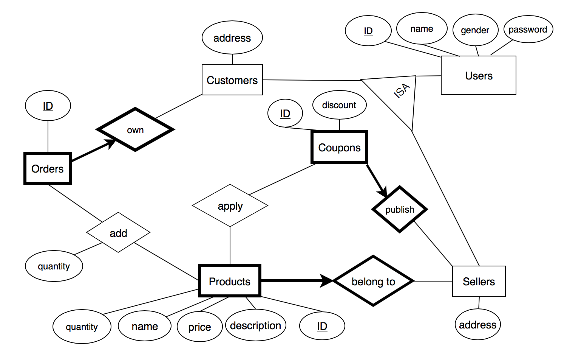

# E-Commerce-Platform

## 1. ER Diagram

## 2. Schema

users (user_id, name, gender, password)

customers (user_id, address)

sellers (user_id, address)

products (product_id, name, description, seller_id, price, quantity)

coupons (coupon_id, discount, seller_id)

orders (order_id, customer_id)

coupon_applied (coupon_id, product_id)

orders_products (order_id, product_id, quantity)

## 3. Functionality Queries

(1) Select the 10 customers with the most products added

``
SELECT C.user_id, SUM(OP.quantity) AS purchase_num
``
 
``
FROM orders_products OP, customers C, orders O 
``
 
``
WHERE C.user_id = O.customer_id AND OP.order_id = O.order_id  
``
 
``
GROUP BY C.user_id  
``
 
``
ORDER BY SUM(OP.quantity) DESC  
``
 
``
LIMIT 10;  
``
 

(2) Select the 10 best sellers in terms of the number of sold products

``
SELECT S.user_id, SUM(OP.quantity) AS sell_num
``
 
``
FROM sellers S, products P, orders_products OP
``
 
``
WHERE S.user_id = P.seller_id and P.product_id = OP.product_id 
``
 
``
GROUP BY S.user_id
``
 
``
ORDER BY SUM(OP.quantity) DESC
``
 
``
LIMIT 10;
``
 

(3) Select the 10 customers whose products are most expensive after using coupons

``
CREATE VIEW discounted_products AS(
``
 
``
SELECT products.product_id, products.price * (1 -(coupons.discount))
``
 
``
FROM products, coupons, coupon_applied
``
 
``
WHERE coupons.coupon_id = coupon_applied.coupon_id and coupon_applied.product_id = products.product_id
);
``
 

``
CREATE VIEW final_price AS(
``
 
``
(SELECT product_id, price 
``
 
``
 FROM products
``
 
``
 WHERE product_id not in (SELECT product_id FROM discounted_products))
 ``
 

``
UNION
``
 

``
(SELECT * FROM discounted_products)
``
 
``
);
``
 

``
SELECT C.user_id
``
 
``
FROM customers C, orders O, orders_products OP, final_price F
``
 
``
WHERE C.user_id = O.customer_id and
``
 
``
	    O.order_id = OP.order_id and
      ``
 
``
	    OP.product_id = F.product_id
      ``
 
``
GROUP BY C.user_id
``
 
``
ORDER BY SUM(F.price) DESC
``
 
``
LIMIT 10;
``
